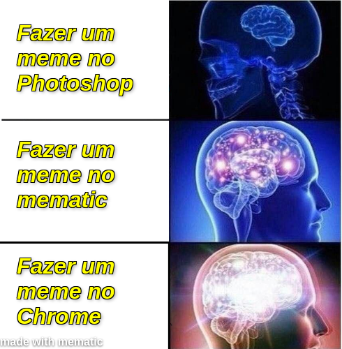

Se não ficou claro pelo meu post sobre [slides](slides), eu
adoro fazer coisas de um jeito criativo e diferente do
padrão. Eu chamo essas filosofia de fazer tudo errado. Tem
funcionando bem pra mim.

No post mencionado eu falo sobre como eu uso markdown e css
pra fazer algo que eles não foram feitos pra fazer: slides.
Nesse post eu vou mostrar como eu uso as ferramentas de
desenvolvimento do Chrome para fazer posts de divulgação.

## o problema

Na nossa empresa júnior muita gente entra pro núcleo de
markting sem muito conhecimento em photoshop e amigos, já
que não ensinamos essas ferramentas. Mas nós ensinamos CSS.

CSS e HTML são muito flexíveis, e Web Designers fazem uns
trem muito fofo só com isso. E se usássemos o poder do CSS
pra fazer o que fazemos com o Photoshop?

Minha ideia inicial era criar uma aplicação, que criasse uma
árvore de divs, e um editor pra estilizar cada uma delas. Ia
envolver um parsing da folha de estilos pra gerar editores
de propriedade intuitivos e várias coisas legais.

Enquanto tentava implementar tudo isso, eu descobri duas
coisas: 1. eu sou muito incompetente pra fazer isso e 2.
várias das features que eu queria implementar (criar uma
ávore de divs, autocomplete de CSS), já estão presentes nas
ferramentas de desenvolvedor dos navegadores!

## fazendo arte

É bem simples fazer artes no navegador. Comece com um
arquivo em branco e abra a janela de Developer Tools
(geralmente F12).

Agora vá criando novas 'layers' no `<body>`. O Firefox tem
um botão conveninte para adicionar um novo nó. No Chrome tem
que ir na mão e ir editando o HTML.

Na parte de baixo do DevTools tem uma região para editar
o estilo do elemento. Vai jogando as propriedades ali e vai
vendo como fica.

Quando tudo estiver pronto, basta selecionar a raiz da sua
árvore e tirar um screenshot do nó. No Firefox a opção está
no menu de contexto. No Chrome basta dar Ctrl+Shift+P
e pesquisar a ação. Agora você deve ter a sua arte
finalizada na sua pasta de Downloads.

## isso não é a mesma coisa brenno

Isso ta longe de substituir a minha ideia original, quem
dirá ferramentas estabelecidas como o photoshop. Mas
é melhor que o Gimp pelo menos.

CSS é todo sobre layout bem visualizáveis, então achar
o posicionamento ideal dos elementos vai demandar tempo. Mas
pelo menos quando você muda o conteúdo, todo o layout se
reajusta.

## ainda não estou convencido

Neste momento você deve ser
a [Jasmine](https://youtu.be/UTbjH19gqBE?t=128) perguntando
"Mas por quê?" e eu sou apenas a Mhissy respondendo "Porque
Não". Ás vezes a gente precisa ser um pouco Jurassic Park
e não se perguntar se
[devemos](https://www.youtube.com/watch?v=kY-pUxKQMUE).

## bônus

Esse é o HTML do meme lá de cima

```html
<div
  style="background-image: url('https://imgflip.com/s/meme/Expanding-Brain.jpg');height: 500px;background-size: 490px;background-repeat: no-repeat;width: 490px;"
>
  <div
    style="height: 100%;display: flex;flex-direction: column;justify-content: space-around;font-family: Arial;font-weight: bold;text-shadow: 2px 2px 4px #0006, 1px 1px 0 #000, 1px -1px 0 #000, -1px 1px 0 #000, -1px -1px 0 #000;color: yellow;font-style: italic;font-size: 2em;width: 240px;align-items: center;"
  >
    <div class="pad">
      Fazer um meme no Photoshop
    </div>
    <div class="pad">
      Fazer um meme no mematic
    </div>
    <div class="pad">
      Fazer um meme no Chrome
    </div>
  </div>
  <div
    style="position: relative;bottom: 20px;font-family: arial;font-weight: bold;color: white;text-shadow: 0 1px 2px #000000b0;"
  >
    made with mematic
  </div>
</div>
```
